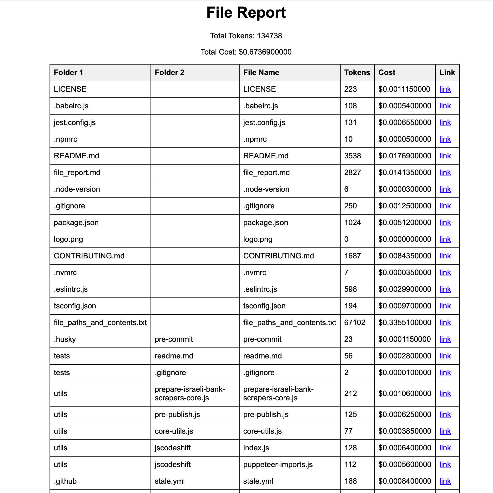
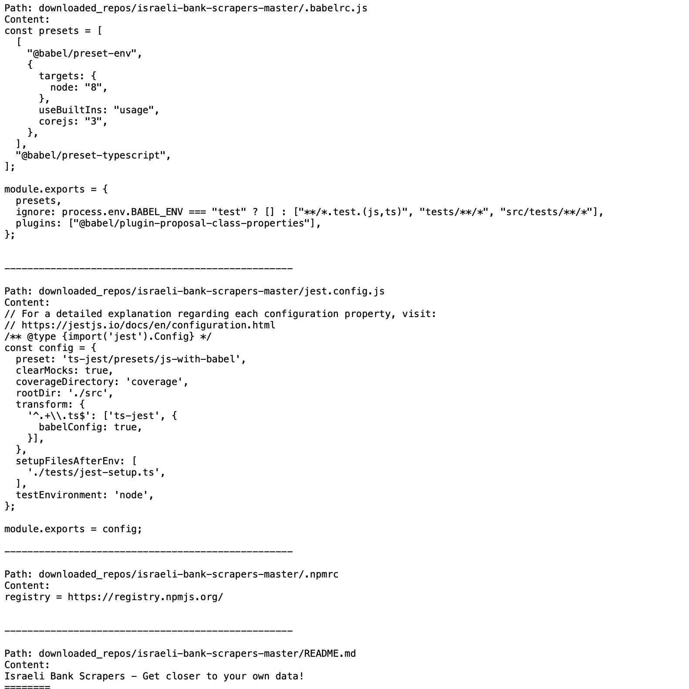

# Git-2-GPT

Let's make Github repositories exploration fast! Take a repo URL, download it, filter out irrelevant files, consolidate all relevant text files into a single file, and generate statistics and reports. The report includes total tokens, costs, and provides links to the individual files for easy access.

|                              |                        |
| ------------------------------------------------------------ | ------------------------------------------------------------ |
| **HTML Report**: Provides overview of the repository, including total tokens, cost, and links to each file. | **Consolidated File**: Gets contents of all relevant text files into one, making it easy to insert into LLMs. |

## Features

- **Download GitHub Repositories**: The script downloads repositories directly from GitHub.
- **File Filtering**: Irrelevant files (e.g., binary files, package-lock.json, .DS_Store) are automatically excluded.
- **Consolidation**: All relevant text files are consolidated into a single output file.
- **Statistics**: The script generates statistics including the total number of tokens and the associated costs.
- **Interactive Report**: An HTML report is generated, which includes links to each file for easy access.

## Installation

1. **Clone the Repository**: First, clone this repository to your local machine.
    
    ```bash
    git clone https://github.com/ofirsteinherz/Git-2-GPT
    cd Git-2-GPT
    ```
    
2. **Install the Required Dependencies**: Use `pip` to install the necessary Python libraries.
    ```bash
    pip install -r requirements.txt
    ```

    The `requirements.txt` file includes:
    - `requests`: For downloading GitHub repositories.
    - `tokencost`: For calculating the cost and token count for text files (currently as input for GPT-4o).

## Usage

1. **Run the Script**: You can run the script by using the following command:
    ```bash
    python main.py
    ```

2. **Provide GitHub Repository URL**: When prompted, enter the URL of the GitHub repository you want to analyze. For example:
    ```
    Enter the GitHub repo URL: [PASTE REPOSITORY LINK HERE]
    ```

3. **View the Output**: 
    - **HTML Report**: An HTML report is created that includes statistics and links to the individual files.
    - **Text File**: The script generates a text file that consolidates the contents of all relevant text files.

## Output

- **HTML Report**: The HTML report includes:
  - Total tokens
  - Total cost
  - A table showing each file, its token count, cost, and a link to view the file.
- **Consolidated File**: This file contains the paths and contents of all relevant text files from the repository.

## Example

Here’s an example of what you can expect in the HTML report:

- **Total Tokens**: 1500 tokens
- **Total Cost**: $0.0015
- **File Table**: 
  - File Name
  - Tokens
  - Cost
  - Link (Clickable link to view the file)

## Purpose

This project was developed to aggregate and analyze projects from GitHub, specifically focusing on relevant files and providing a comprehensive overview with easy access via links. It is particularly useful for talking with repository with the help of large language model, especially for understanding the content and associated computational costs.
